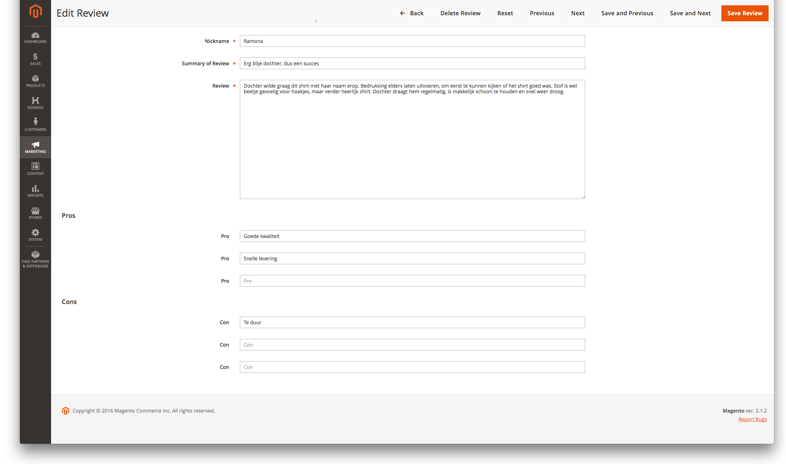

# H&O Review
Add pros and cons to reviews.

## Considerations (KINGDO-67, 5pnt)
Configurations can be found in **Stores > Configuration > H&O > Review Settings**. From there the module output on the frontend can be enabled/disabled.
It's also possible to change the maximum amount of considerations.

## Installation
```BASH
composer config repositories.honl/honl/magento2-review vcs git@github.com:ho-nl/magento2-Ho_Review.git
composer require honl/magento2-review
```

## Todo
- [ ] Styling.
- [ ] Update screenshots after styling?

## Mobile


## Desktop
